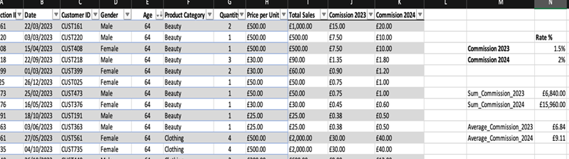
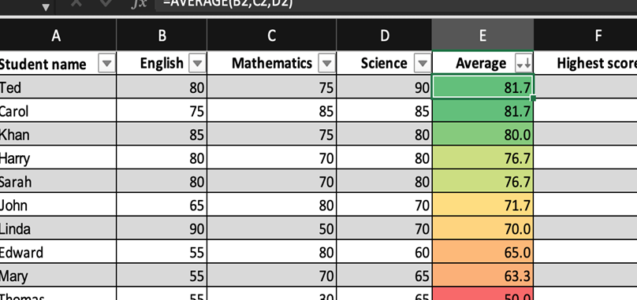
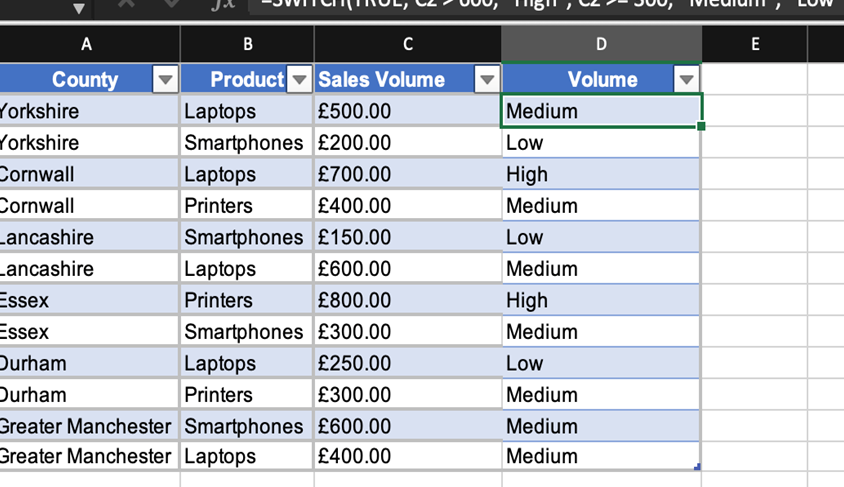
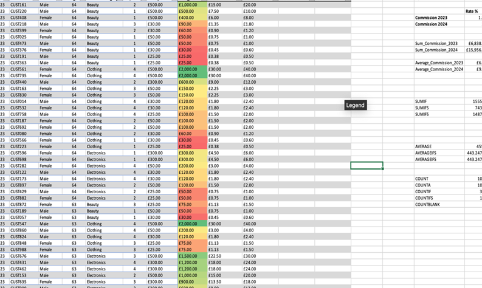
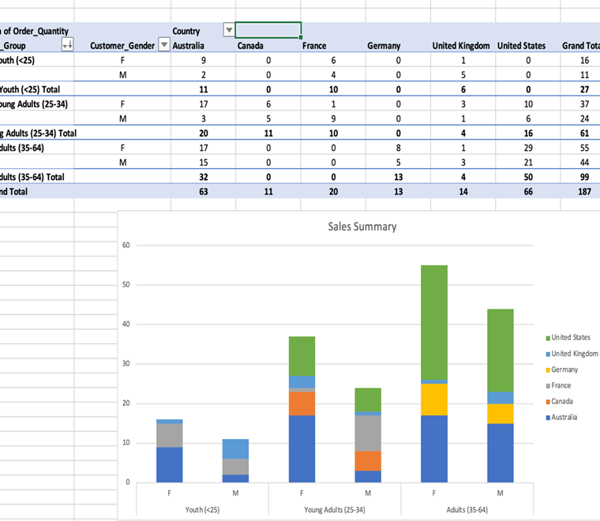
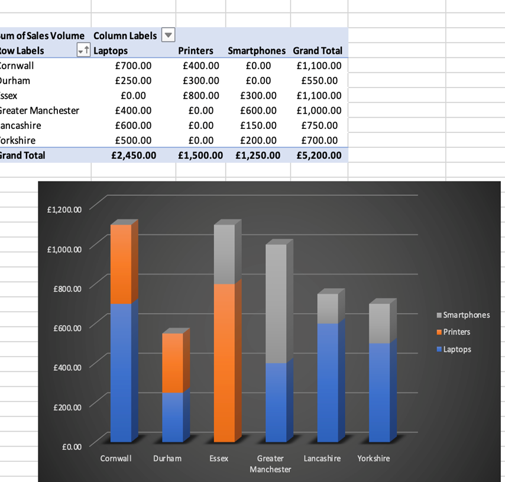
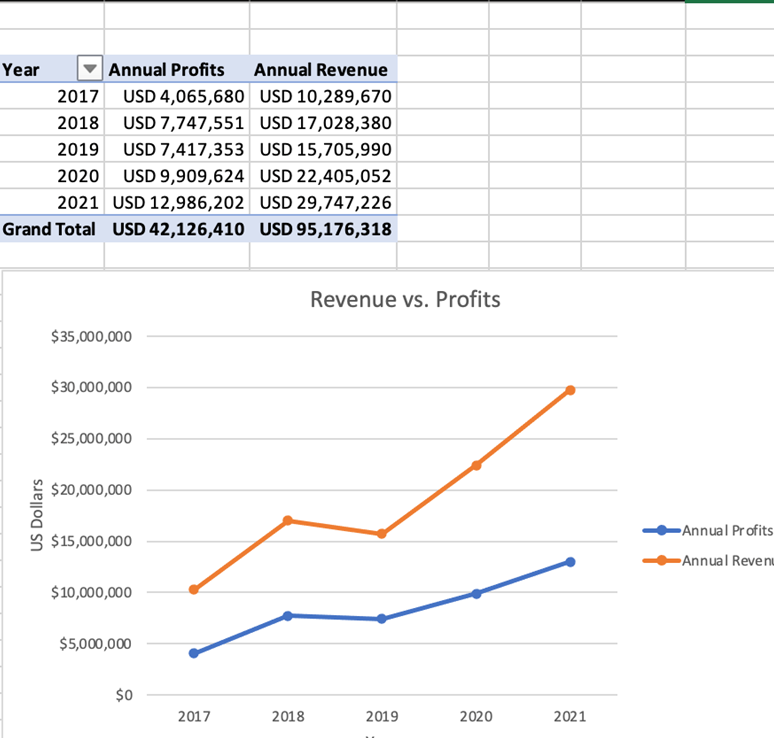
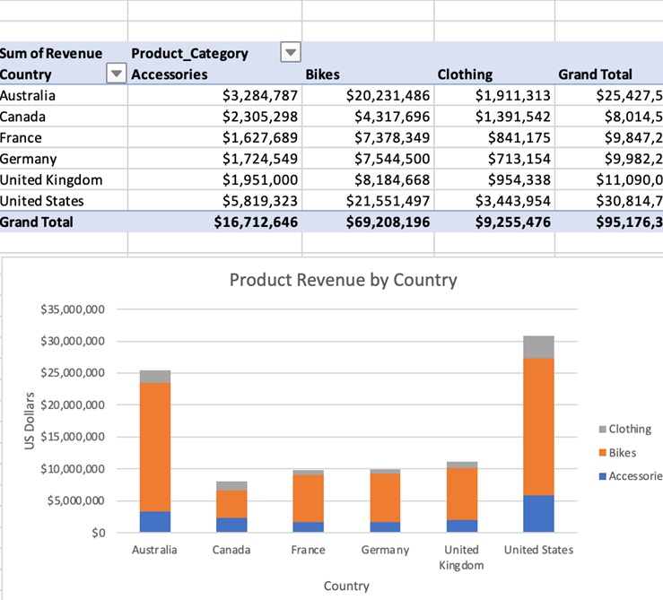

# 📊 Week 1 Portfolio – Data Technician Bootcamp (Level 3)

**Umar Azom**

**Focus Areas:** Excel Fundamentals | Data Governance | Formulas | Pivot Tables | Conditional Formatting | Data Visualisation

---

## 🚀 Professional Summary

Week 1 focused on building strong Excel foundations for data analysis.

This included:

- Understanding UK data governance and compliance frameworks  
- Structuring and cleaning datasets  
- Applying core Excel formulas (SUM, AVERAGE, MAX, COUNT)  
- Creating Pivot Tables for summarisation  
- Using logical functions (SWITCH)  
- Designing charts to communicate insights visually  

This week established core spreadsheet competency required for entry-level analytical roles.

---

# 📅 Day 1 – Data Governance & Compliance

Researched and reviewed key UK data regulations:

- Data Protection Act  
- GDPR  
- Freedom of Information Act  
- Computer Misuse Act  

Developed understanding of:

- Lawful data processing  
- Individual data rights  
- Organisational accountability  
- Risks of non-compliance  

Demonstrated awareness of ethical and legal responsibilities when handling data.

---

# 📅 Day 2 – Excel Formulas & Data Manipulation

## 📈 Retail Sales Dataset Analysis

Worked with transactional retail data to:

- Convert raw dataset into structured Excel table  
- Sort age (largest to smallest)  
- Calculate total commission using `SUM()`  
- Calculate average commission using `AVERAGE()`  
- Apply table formatting and structured references  

### Visual

---

## 🎓 Student Score Analysis

Applied:

- `AVERAGE()` function  
- `MAX()` function  
- Sorting (highest to lowest performance)  
- Conditional Formatting (performance heat scale)  

Identified top-performing students and highlighted performance tiers visually.

### Visual

---

# 📅 Day 3 – Pivot Tables & Logical Functions

## 🚲 Bike Sales Pivot Analysis

Created Pivot Table summarising sales by:

- Country  
- Age group  
- Gender  

Identified key performance segments across markets.

### Visual

---

## 🏷️ Product Categorisation Using SWITCH

Applied logical formula:

=SWITCH(TRUE, C2 > 600, "High", C2 >= 300, "Medium", "Low")

Used dynamic categorisation to segment sales volume into business-relevant tiers.

### Visual

---

# 📊 Day 4 – Data Visualisation & Reporting

## 📌 County Sales Summary

Built Pivot Table and 3D stacked column chart to compare:

- Laptops  
- Printers  
- Smartphones  

Across multiple counties.

### Visual

---

## 📈 Revenue vs Profit Trend Analysis

Created multi-year line chart comparing:

- Annual Revenue  
- Annual Profits  

Identified steady upward trend with increasing profit margins over time.

### Visual

---

## 🌍 Product Revenue by Country

Designed stacked column chart to compare revenue contribution by:

- Accessories  
- Bikes  
- Clothing  

Across international markets.

### Visual

---

## 👥 Revenue Comparison by Age Group

Created pie chart to analyse revenue distribution across:

- Adults (35–64)  
- Young Adults (25–34)  
- Youth (<25)  
- Seniors (64+)  

Identified Adults (35–64) as the primary revenue-driving segment.

### Visual

---

# 🧠 Key Skills Demonstrated

- Data structuring and cleaning  
- Structured Excel tables  
- Excel formulas (SUM, AVERAGE, MAX, COUNT, SWITCH)  
- Pivot Tables and summarisation  
- Conditional formatting  
- Business data segmentation  
- Visual reporting and chart design  
- Analytical thinking  

---

# 📌 Outcome

Week 1 built foundational Excel capabilities essential for:

- Junior Data Analyst roles  
- Reporting Analyst roles  
- Business Intelligence entry positions  
- Data Technician apprenticeships  

Demonstrated ability to transform raw data into structured insights and business-ready visuals.
