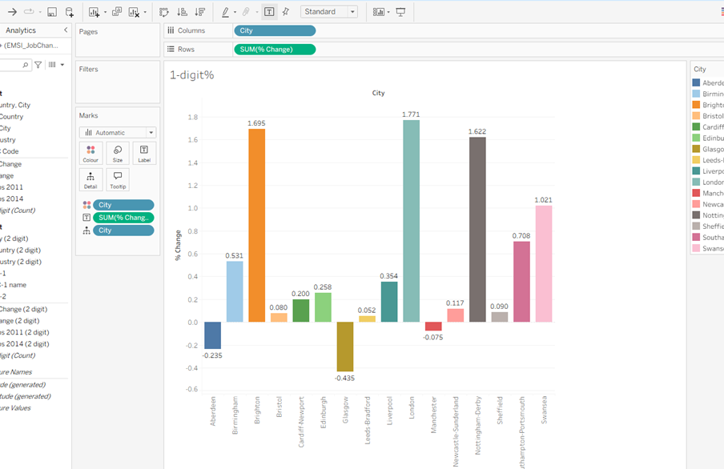
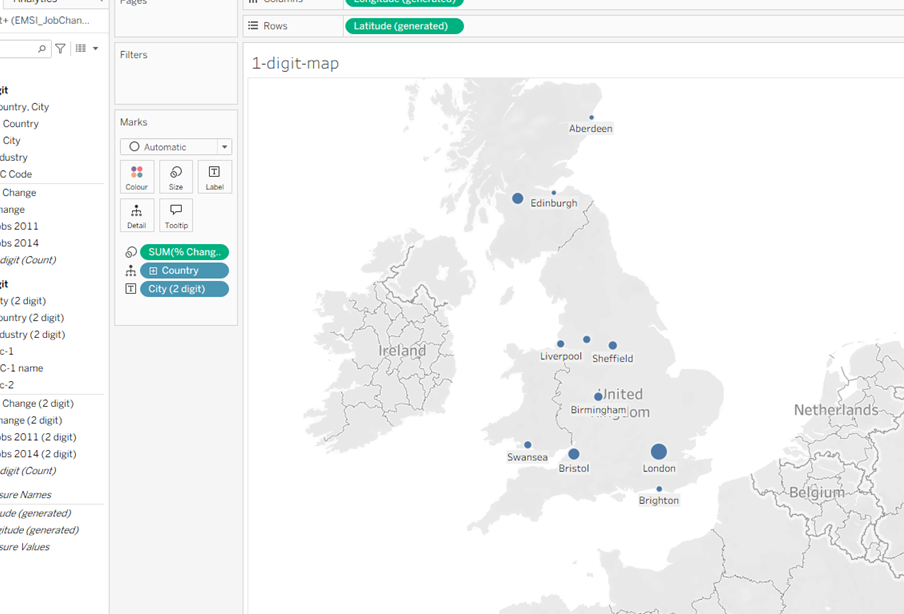
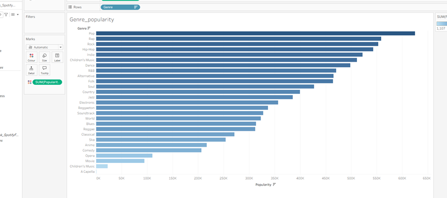
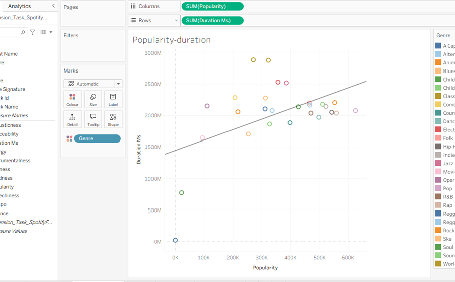
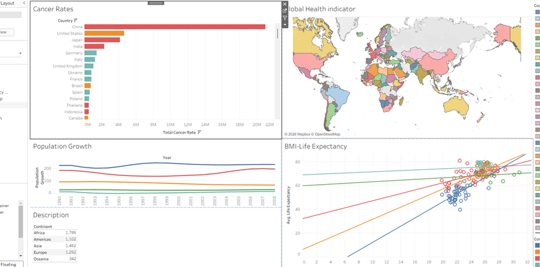
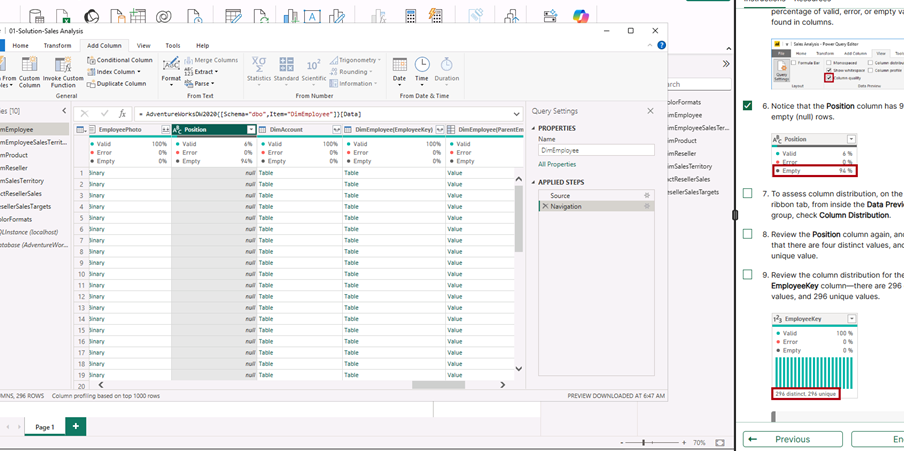
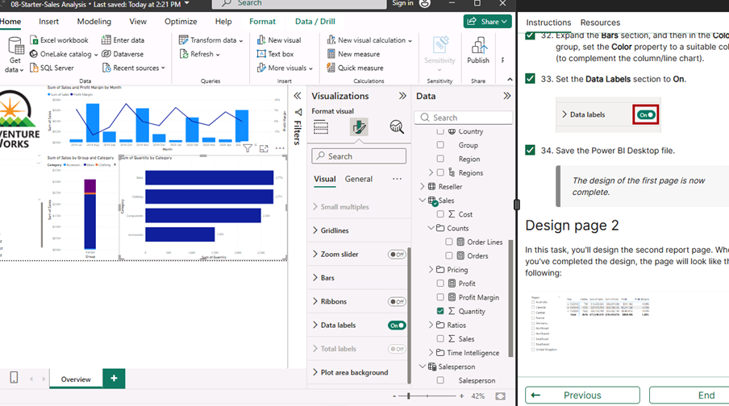
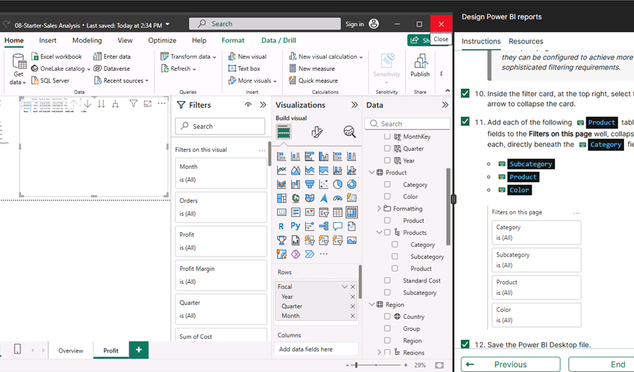

# 📊 Week 2 Portfolio – Data Technician Bootcamp (Level 3)

## 👨‍💻 Umar Azom  
**Focus Areas:** Data Visualisation | Business Intelligence | Power BI | Analytical Reporting  

---

# 🚀 Professional Summary

During Week 2 of the IT Technician Level 3 Bootcamp, I developed practical Business Intelligence skills using Tableau and Power BI.

I worked with real-world datasets covering:

- UK labour market trends  
- Spotify streaming analytics  
- Global health indicators  
- Sales performance reporting (Power BI Labs)

This week focused on transforming raw datasets into structured models, building dashboards, and presenting stakeholder-ready insights.

---

# 🗓️ Day 1 – UK Workforce Analysis (Tableau)

## 📊 EMSI Job Change Dashboard

Built a Tableau dashboard analysing percentage job change across major UK cities.

### Key Insights:

- **London (1.771%)** recorded the highest job growth.
- **Birmingham (1.695%)** and **Nottingham-Derby (1.622%)** showed strong positive change.
- **Leeds-Bradford (-0.435%)** experienced the largest decline.
- Slight contraction observed in **Aberdeen** and **Manchester**.

### Business Application:

- Regional workforce planning  
- Economic investment prioritisation  
- Identifying high-growth vs declining markets  

### 🔎 Visual Evidence

#### UK Job Growth – Percentage Change by City

#### UK Geographic Job Change Map

---

# 🗓️ Day 2 – Spotify Streaming Analytics

## 📈 Genre Popularity Analysis

Ranked genres by total popularity.

### Findings:

- **Pop, Rap, and Rock** dominated overall engagement.
- Lower popularity observed in Opera, Movie, and Children’s categories.
- Engagement highly concentrated in mainstream genres.

### Visual:

---

## 📊 Popularity vs Duration Correlation

Analysed relationship between track duration and popularity using scatter plot with trend line.

### Insight:

- Positive correlation identified.
- Moderate strength relationship.
- Indicates other variables influence streaming success.

### Visual:

---

# 🏥 Day 2 – Global Health Data Analysis

Worked with a multi-variable dataset including life expectancy, BMI, cancer rates, and population growth.

## 🌍 Integrated Global Health Dashboard

Combined multiple views into a structured reporting dashboard.

### Observations:

- Higher life expectancy in Europe and North America.
- Lower averages in parts of Africa.
- Cancer rates highest in China and the United States (population impact).
- Positive BMI–life expectancy trend in developed regions.

### Skills Demonstrated:

- Geographic mapping  
- Trend analysis  
- Multi-sheet dashboard integration  
- Comparative country ranking  

### Visual:

---

# 🗓️ Day 3 – Power BI Data Preparation

## 🔧 Lab 1 – Get Data & Transform

Imported Sales Analysis dataset and worked within Power Query.

### Activities Completed:

- Reviewed multiple tables (FactResellerSales, DimEmployee, etc.)
- Used column profiling tools (valid, error, empty checks)
- Applied filters and reviewed Applied Steps
- Ensured clean, structured data before load

### Technical Skills:

- Data profiling  
- ETL awareness  
- Transformation logic  
- Query validation  

### Visual:

---

## 📦 Lab 2 – Load Transformed Data

Loaded cleaned queries into the data model.

- Applied transformations
- Reviewed relationships
- Prepared structured model for reporting
- Built initial visuals

Demonstrated understanding of separation between Query Editor and Data Model.

---

# 🗓️ Day 4 – Power BI Report Design

## 📊 Multi-Page Report Development

Designed an interactive Power BI report using the transformed dataset.

### Page 1 – Sales Overview

- KPI Cards (Total Sales, Average Profit)
- Regional and category breakdowns
- Visual formatting and layout optimisation

### Visual:

---

### Page 2 – Profit & Performance Analysis

- Profit breakdown by product/category
- Interactive slicers (Category, Subcategory, Colour)
- Monthly sales trend analysis

### Visual:

---

# 🛠 Technical Skills Developed

- Tableau dashboard creation  
- Geographic mapping  
- Correlation analysis  
- Trend evaluation  
- Power Query transformations  
- Data modelling concepts  
- KPI reporting  
- Interactive BI report design  
- Multi-page dashboard creation  

---

# 💼 Professional Development

This week strengthened my ability to:

- Transform raw data into structured, analysis-ready models  
- Extract meaningful insights from diverse datasets  
- Design dashboards that support business and public-sector decision-making  
- Communicate analytical findings clearly and professionally  

I am building strong foundational capability in Business Intelligence with practical experience in both data preparation and reporting.
