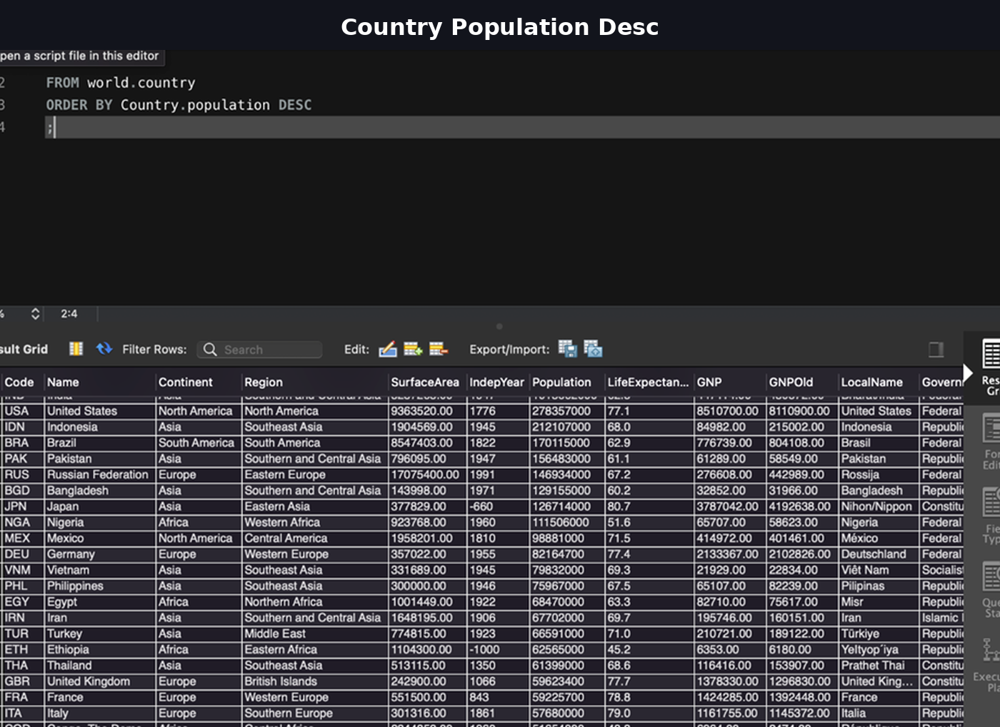
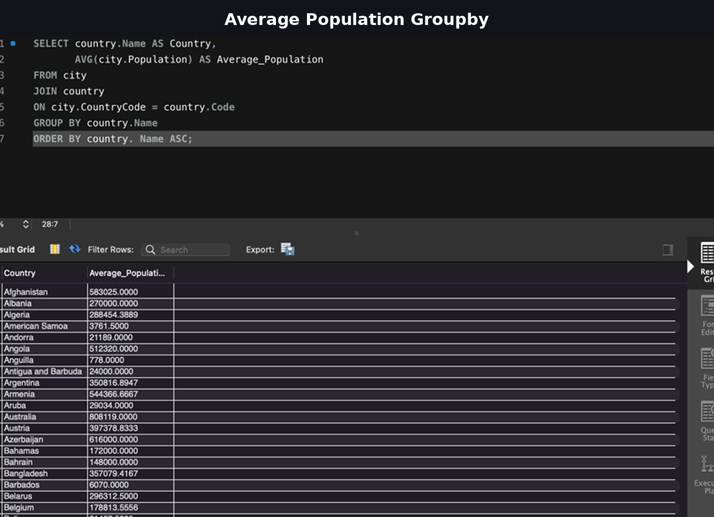
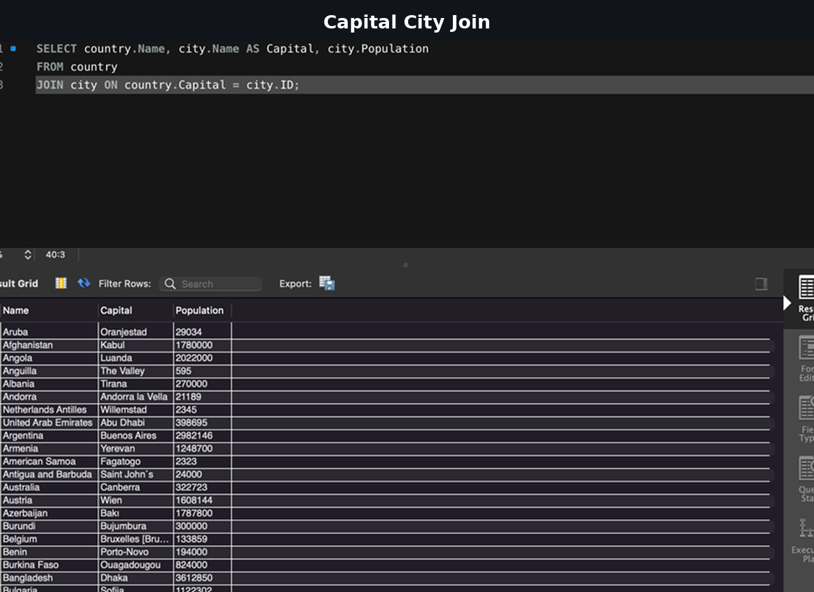
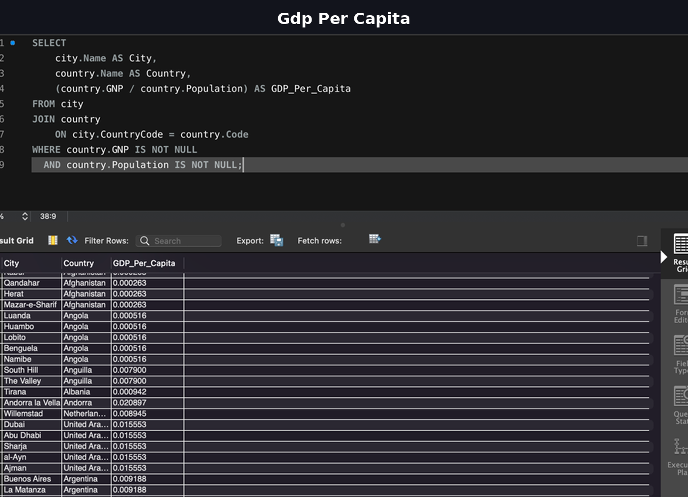
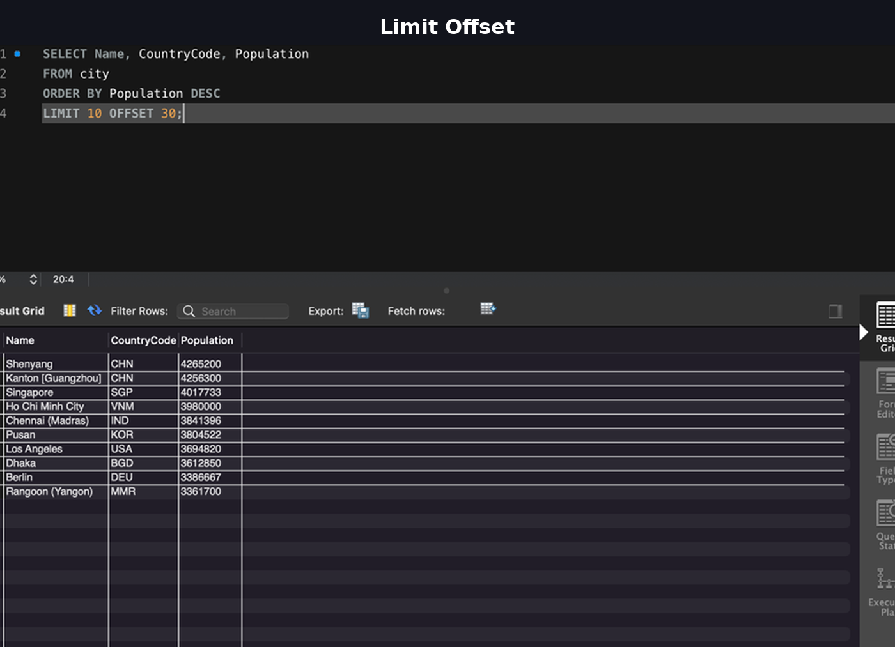

# 🗄 Week 3 – SQL & Relational Database Analysis

## 🔎 Project Overview

This project focused on developing structured SQL querying skills using the MySQL World database.

The objective was to:

- Extract insights from relational datasets
- Perform filtering and sorting operations
- Apply aggregation functions
- Use JOIN operations across tables
- Calculate derived metrics
- Demonstrate understanding of relational schema design

---

## 🛠 Tools Used

- MySQL
- SQL (SELECT, WHERE, GROUP BY, JOIN, ORDER BY)
- Aggregate functions
- Relational database modelling

---

# 📊 Core Querying & Analysis

---

## 📌 Population-Based Ranking

Ordered countries by population to identify global scale differences.

### Insight
Highlights global population concentration and geographic scale differences.

---

## 📌 Aggregation – Average Population by Country

Used JOIN + GROUP BY to compute average city population per country.

### Insight
Demonstrates ability to combine relational tables and derive aggregated statistics.

---

## 📌 Capital Cities (JOIN Operation)

Joined `country` and `city` tables to retrieve capital city data.

### Insight
Shows relational schema understanding and key-based linking between tables.

---

## 📌 GDP Per Capita Calculation

Calculated GDP per capita using derived fields.

### Insight
Demonstrates ability to create calculated metrics from raw fields.

---

## 📌 Correlation & Pagination Logic

Used LIMIT and OFFSET to simulate real-world data pagination.

### Insight
Reflects understanding of scalable query design for large datasets.

---

# 🧠 Technical Skills Demonstrated

- Filtering and sorting
- Aggregate functions (COUNT, AVG)
- GROUP BY
- INNER JOIN
- Calculated columns
- NULL handling
- Pagination (LIMIT & OFFSET)
- Relational schema understanding

---

# 💼 Recruiter Relevance

This project demonstrates:

✔ Strong SQL fundamentals  
✔ Ability to extract structured insights  
✔ Real-world JOIN operations  
✔ Analytical thinking using relational databases  
✔ Scalable query structuring  

This reflects junior data analyst / junior data engineer readiness.

---
