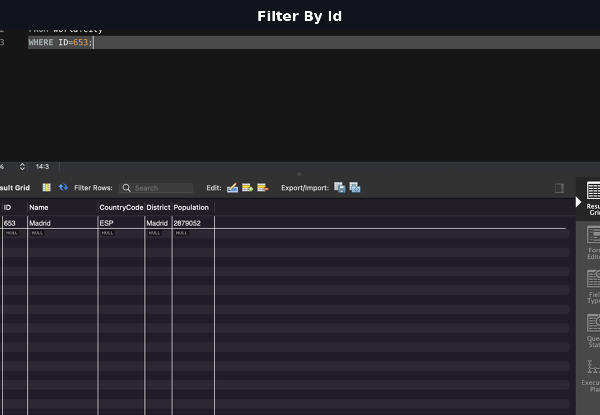
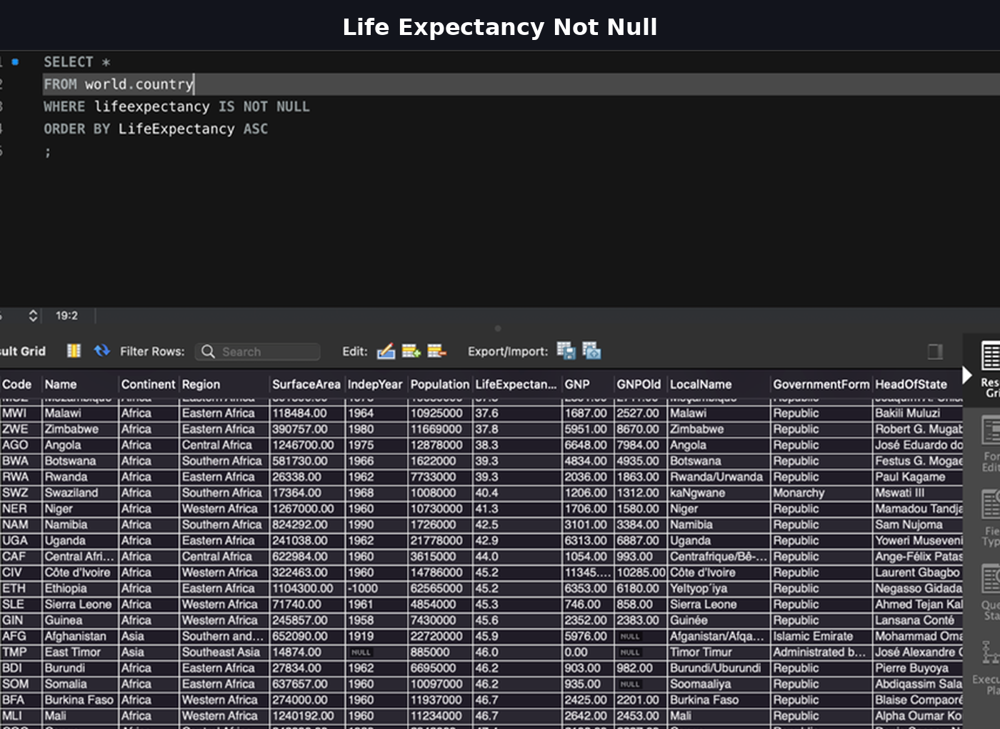
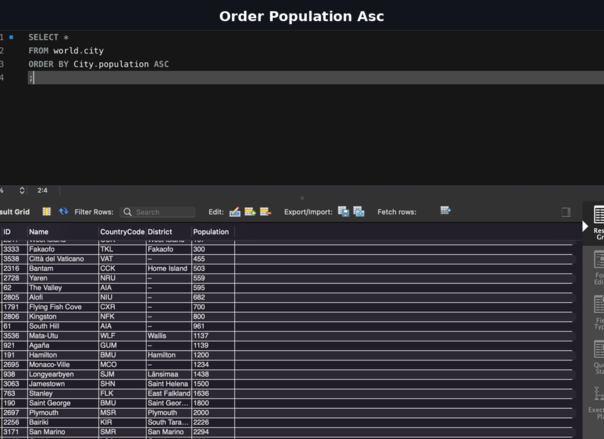
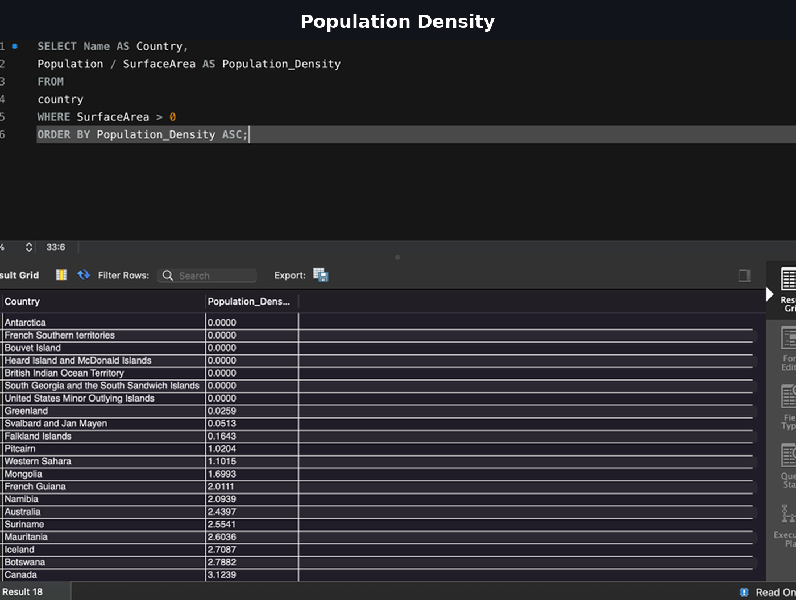

# 🗄️ Week 3 Portfolio – SQL & Relational Databases  
**Data Technician Bootcamp (Level 3)**  
**Umar Azom**

---

## 📌 Focus Areas
SQL Querying | Relational Database Design | JOIN Operations | Aggregation | NULL Handling | Calculated Fields | Pagination | Data Integrity

---

# 📖 Overview

Week 3 focused on developing practical SQL skills using the **MySQL World Database**.  
The week progressed from fundamental querying to multi-table joins, aggregation, calculated metrics, and structured relational database design.

By the end of the week, I demonstrated the ability to:

- Write efficient SELECT queries
- Apply filtering and sorting logic
- Use aggregate functions (COUNT, AVG)
- Perform JOIN operations across tables
- Handle NULL values correctly
- Create calculated metrics (GDP per capita, population density)
- Implement pagination using LIMIT and OFFSET
- Design a relational database schema from business requirements

---

# 🏗️ Database Design – Retail Business Case Study

As part of the written task, I designed a structured relational database for a small retail shop managing:

- Inventory
- Sales
- Customers
- Loyalty Program

## Core Tables Designed

### Customers
```sql
CREATE TABLE Customers (
    CustomerID INT AUTO_INCREMENT PRIMARY KEY,
    First_Name VARCHAR(50) NOT NULL,
    Last_Name VARCHAR(50) NOT NULL,
    Phone VARCHAR(20),
    Loyalty_Points INT DEFAULT 0
);
```

### Inventory
```sql
CREATE TABLE Inventory (
    ProductID INT AUTO_INCREMENT PRIMARY KEY,
    Product_Name VARCHAR(100) NOT NULL,
    Category VARCHAR(50),
    Price DECIMAL(8,2) NOT NULL,
    Stock_Quantity INT NOT NULL
);
```

### Transactions
```sql
CREATE TABLE Transactions (
    TransactionID INT AUTO_INCREMENT PRIMARY KEY,
    Sale_Date DATETIME NOT NULL,
    Sale_Total DECIMAL(10,2) NOT NULL,
    CustomerID INT,
    FOREIGN KEY (CustomerID) REFERENCES Customers(CustomerID)
);
```

### SalesItems (Junction Table)
```sql
CREATE TABLE SalesItems (
    SaleItemID INT AUTO_INCREMENT PRIMARY KEY,
    TransactionID INT NOT NULL,
    ProductID INT NOT NULL,
    Quantity INT NOT NULL,
    Price DECIMAL(8,2) NOT NULL,
    FOREIGN KEY (TransactionID) REFERENCES Transactions(TransactionID),
    FOREIGN KEY (ProductID) REFERENCES Inventory(ProductID)
);
```

### Key Design Principles Applied

- Primary & Foreign Keys for relational integrity
- Normalised structure
- Junction table to support one-to-many relationships
- Constraints to prevent invalid data
- Planned backups and access-level control for security

---

# 🌍 SQL Practical – World Database Analysis

---

## 1️⃣ Count Cities in the USA

```sql
SELECT COUNT(*) AS Total_Cities_USA
FROM city
WHERE CountryCode = 'USA';
```


---

## 2️⃣ Countries by Population (Descending)

```sql
SELECT *
FROM world.country
ORDER BY Population DESC;
```


---

## 3️⃣ Filter by Primary Key (ID Lookup)

```sql
SELECT *
FROM world.city
WHERE ID = 653;
```



---

## 4️⃣ Exclude NULL Life Expectancy

```sql
SELECT *
FROM world.country
WHERE LifeExpectancy IS NOT NULL
ORDER BY LifeExpectancy ASC;
```



---

## 5️⃣ Order Cities by Population (Ascending)

```sql
SELECT *
FROM world.city
ORDER BY Population ASC;
```



---

## 6️⃣ Cities Starting with 'New'

```sql
SELECT *
FROM world.city
WHERE Name LIKE 'New%';
```


---

## 7️⃣ Cities Starting with 'Be'

```sql
SELECT *
FROM world.city
WHERE Name LIKE 'Be%';
```


---

## 8️⃣ Population Between 500k and 1M

```sql
SELECT *
FROM world.city
WHERE Population BETWEEN 500000 AND 1000000;
```


---

## 9️⃣ Average Population per Country (Aggregation + JOIN)

```sql
SELECT country.Name AS Country,
       AVG(city.Population) AS Average_Population
FROM city
JOIN country
ON city.CountryCode = country.Code
GROUP BY country.Name
ORDER BY country.Name ASC;
```


---

## 🔟 City Name Frequency Analysis

```sql
SELECT city.name,
       COUNT(*) AS Frequency
FROM city
GROUP BY city.name
ORDER BY city.name ASC;
```


---

## 1️⃣1️⃣ Capital Cities via JOIN

```sql
SELECT country.Name,
       city.Name AS Capital,
       city.Population
FROM country
JOIN city
ON country.Capital = city.ID;
```


---

## 1️⃣2️⃣ GDP per Capita Calculation

```sql
SELECT city.Name AS City,
       country.Name AS Country,
       (country.GNP / country.Population) AS GDP_Per_Capita
FROM city
JOIN country
ON city.CountryCode = country.Code
WHERE country.GNP IS NOT NULL
AND country.Population IS NOT NULL;
```


---

## 1️⃣3️⃣ Pagination (Rows 31–40)

```sql
SELECT Name, CountryCode, Population
FROM city
ORDER BY Population DESC
LIMIT 10 OFFSET 30;
```


---

# 🧠 Advanced Calculations

### Population Density

```sql
SELECT Name AS Country,
       Population / SurfaceArea AS Population_Density
FROM country
WHERE SurfaceArea > 0
ORDER BY Population_Density ASC;
```



---

# 🛠 Skills Demonstrated

✔ SQL Query Writing  
✔ Filtering & Sorting  
✔ Aggregate Functions (COUNT, AVG)  
✔ GROUP BY  
✔ INNER JOIN  
✔ Data Relationships  
✔ NULL Handling  
✔ Calculated Metrics  
✔ Pagination (LIMIT & OFFSET)  
✔ Relational Database Design  
✔ Schema Structuring  

---

# 🎯 Week 3 Summary

This week strengthened my understanding of relational databases and SQL query development.  

I demonstrated the ability to:

- Extract meaningful insights from structured datasets  
- Combine multiple tables using JOINs  
- Apply aggregation functions for analysis  
- Perform calculated field analysis  
- Design structured relational schemas from business requirements  

Week 3 marked a major step forward in practical database querying and analytical capability.

---
