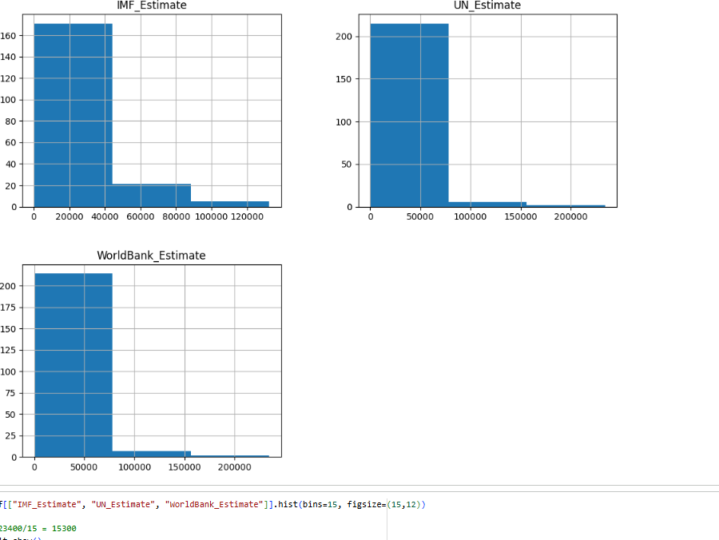
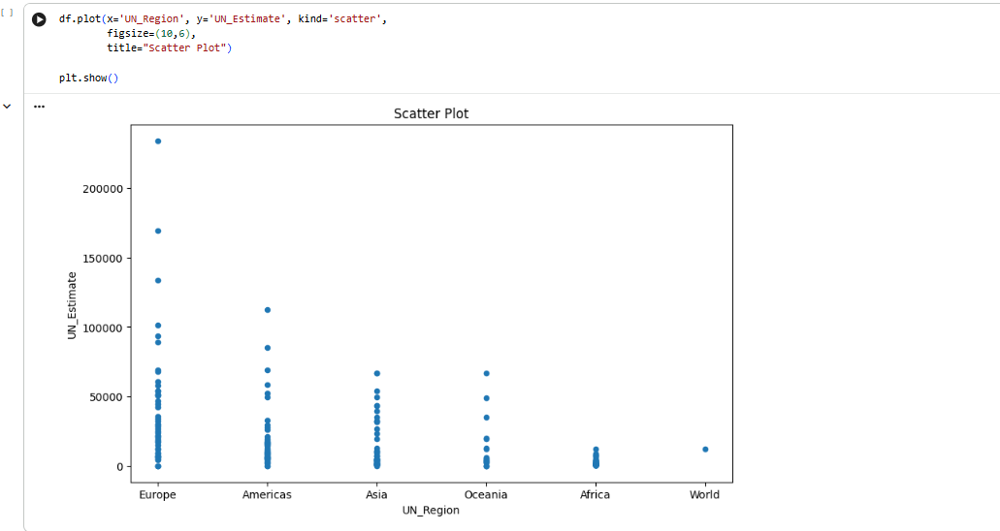
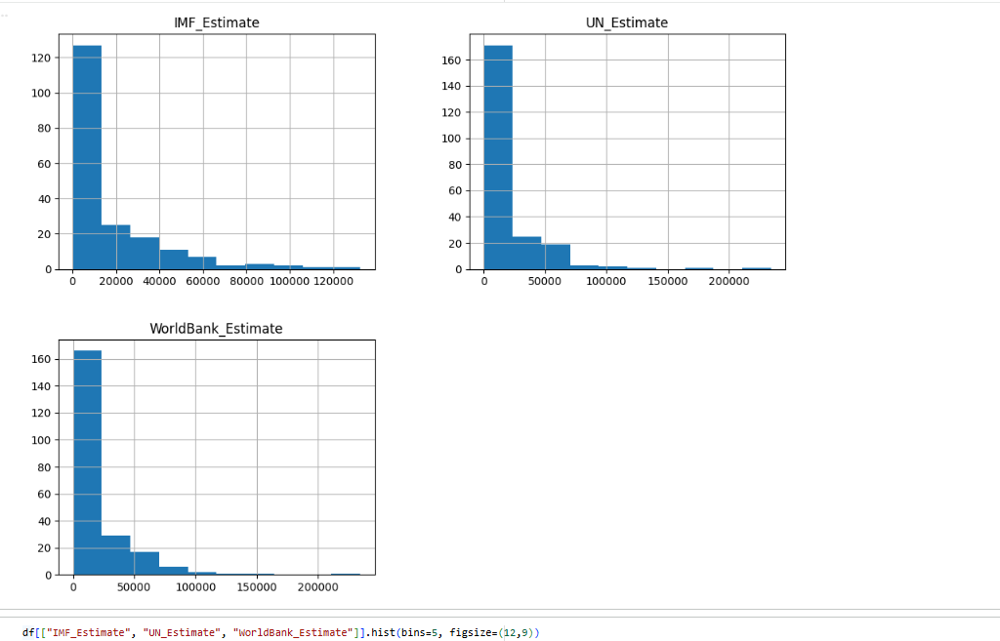
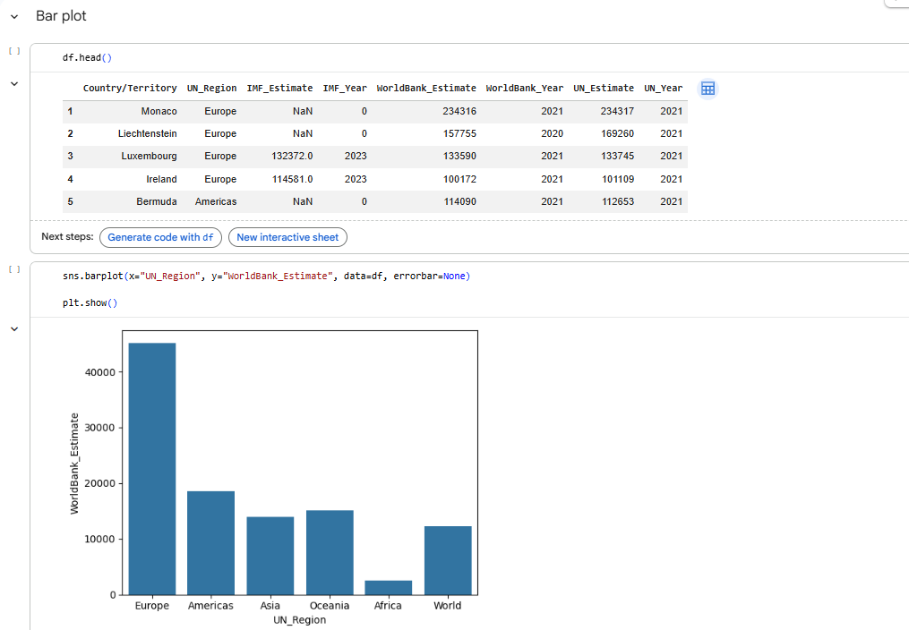

# 📊 Week 6 – Advanced Python Data Analysis

**Technologies Used:**  
Python | Pandas | NumPy | Matplotlib | Seaborn  

**Focus Areas:**  
Exploratory Data Analysis (EDA) | Statistical Analysis | Aggregation | Visualisation | Insight Extraction  

---

# 🧮 Day 2 – Python Fundamentals

Implemented control flow logic using loops and conditionals (FizzBuzz exercise).

## Skills Demonstrated
- For loops
- Conditional statements
- Modulus operations
- Logical reasoning

---

# 📁 Day 3 – Data Manipulation with Pandas

Performed structured data operations including:

- Loading CSV datasets
- Inspecting structure and data types
- Handling missing values
- Filtering and grouping
- Aggregation using `groupby()`
- Sorting and exporting results

---

# 🌍 Day 4 – Global GDP Per Capita Analysis

Conducted full exploratory data analysis on GDP (Nominal) Per Capita dataset using IMF, UN, and World Bank estimates.

---

## 📊 1. GDP Distribution Analysis

Visualised the distribution of GDP per capita estimates to understand spread and skewness.

### Key Insight
GDP per capita values are heavily right-skewed.  
A small number of countries have extremely high GDP per capita compared to the global majority.

---

## 📈 2. Average GDP by UN Region

Calculated the mean GDP per capita per UN region and visualised the results.

### Key Insight
- Europe has the highest regional average GDP per capita.
- Africa has the lowest average.
- Significant economic disparity exists across global regions.

---

## 🔎 3. Countries Below World Average (IMF Estimate)

Calculated the global IMF average and filtered countries below this threshold.

### Key Insight
This analysis highlights countries performing below the global benchmark, identifying potential developing and emerging economies.

---

## 📊 4. Correlation Analysis Between GDP Sources

Computed and visualised correlation matrix between IMF, UN, and World Bank GDP estimates.

### Key Insight
- IMF and World Bank estimates show extremely strong positive correlation (~0.99).
- UN estimates are also highly correlated.
- Confirms consistency across international economic reporting sources.

---

# 🧠 Technical Skills Strengthened

- Data cleaning and preprocessing
- Handling missing and zero values
- Descriptive statistics
- Correlation analysis
- Distribution analysis
- Business insight interpretation
- Professional data visualisation
- Structured exploratory data analysis

---

# 🎯 Portfolio Value

This project demonstrates:

✔ Independent exploratory data analysis  
✔ Statistical reasoning and interpretation  
✔ Ability to derive insights from economic datasets  
✔ Clean and professional visual presentation  
✔ Real-world analytical thinking  
